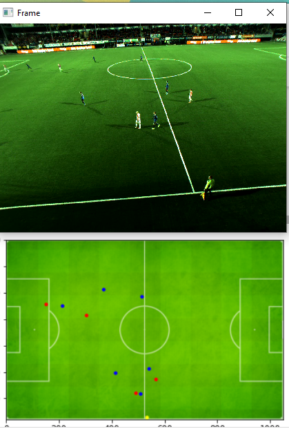

# Football Player Detection, Classification, and Homography Mapping

This repository preserves and reorganizes a Spring 2021 undergraduate computer-vision project from K. N. Toosi University of Technology. Given a fixed-camera football video, the project detects people, classifies them as members of either team or as referees, and projects their locations onto a top-down field map.

The implementation deliberately combines classical computer vision with a neural network: player detection uses background subtraction and connected components, while a compact CNN performs the three-class classification.

## Demo


The animation was generated from the preserved 24-second input clip with the cleaned pipeline. Bounding-box and map colors represent red-team players, blue-team players, and referees.

<details>




## Pipeline


### Detection

The detector uses OpenCV's KNN background subtractor, removes its shadow class with a binary threshold, and applies custom vertically oriented opening and closing kernels. Connected components are filtered with perspective-aware area thresholds: distant players may occupy only a few pixels, while components close to the camera must be much larger.

This is a motion detector rather than a semantic person detector. It works because the source footage comes from a fixed stadium camera.

### Homography and mapping

Nine manually selected field correspondences are passed to `cv2.findHomography` with RANSAC. Each accepted component is represented by the bottom-center of its bounding box—the approximate contact point between the player and the ground—and transformed into the coordinate system of the top-down field image.

The source correspondences were calibrated for the preserved 1280 x 960 camera view. The cleaned pipeline scales them when the input or map resolution changes, although using footage from a different camera still requires new correspondences.

### Classification

The saved CNN expects 45 x 45 OpenCV BGR crops and predicts:

| Class | Meaning | Map color |
|---:|---|---|
| 0 | Red team | Red |
| 1 | Blue team | Blue |
| 2 | Referee | Yellow |

Its architecture is:

| Layer | Output |
|---|---:|
| 5 x 5 convolution, 6 filters + ReLU | 41 x 41 x 6 |
| 2 x 2 max pooling | 20 x 20 x 6 |
| 3 x 3 convolution, 14 filters + ReLU | 18 x 18 x 14 |
| 2 x 2 max pooling | 9 x 9 x 14 |
| Dense + ReLU | 150 |
| Dense + ReLU | 80 |
| Softmax | 3 |

The network contains approximately 183,799 trainable parameters. The included architecture was produced with Keras 2.3.1 and a TensorFlow backend. For inference, the repository includes a lightweight NumPy implementation of the network's convolution, pooling, dense, and softmax operations, so the preserved weights run on current Python versions without legacy TensorFlow.

## Dataset summary

The dataset is not redistributed in this repository. The original local archive contains 45 x 45 RGB crops with the following distribution:

| Split | Red | Blue | Referee | Total |
|---|---:|---:|---:|---:|
| Training | 2,503 | 1,173 | 714 | 4,390 |
| Test | 432 | 298 | 91 | 821 |

An additional 5,112 crops were stored in `other*` directories and appear to be unlabeled or rejected detection candidates. See [data/README.md](data/README.md) for the expected local layout.

## Repository layout

```text
assets/       Field map, regenerated demo GIF, and preserved result image
data/         Dataset layout and provenance notes; no dataset files
examples/     Instructions for supplying a local input clip
experiments/  Historical optional-tracking notebook and notes
legacy/       Original 2021 source files, preserved without cleanup
models/       Original Keras architecture and trained weights
src/          Cleaned inference and training entry points
tests/        Lightweight repository-integrity tests
```

## Environment

The default inference path works on current Python versions and does not require TensorFlow:

```bash
python -m venv .venv
python -m pip install -r requirements.txt
```

On Windows, activate the environment with:

```powershell
.\.venv\Scripts\Activate.ps1
```

## Run the pipeline

From the repository root:

```bash
python src/pipeline.py \
  --input path/to/input.mp4 \
  --output artifacts/mapped-output.mp4 \
  --display
```

Press `q` or Escape to stop the live display. The default output places the annotated camera frame and the top-down map side by side. Add `--output-view map` for a map-only video.

To exercise detection and mapping without installing TensorFlow:

```bash
python src/pipeline.py \
  --input path/to/input.mp4 \
  --output artifacts/detection-only.mp4 \
  --detection-only
```

The classifier backend defaults to `auto`: TensorFlow is used when available, with a transparent fallback to the bundled NumPy inference implementation. Use `--classifier-backend numpy` to select the lightweight implementation explicitly.

The default homography is specific to the course footage. It should not be expected to align footage from another stadium or camera position.

## Train the classifier

Point the training program to a local directory with the layout documented under `data/`:

```bash
python src/train_classifier.py \
  --data-root path/to/Dataset \
  --epochs 10
```

Recreating the historical training environment requires Python 3.8 and the separate pinned dependencies:

```bash
python -m pip install -r requirements-training.txt
```

The program saves the model architecture, weights, and a JSON training history. The historical training process used the supplied test split as validation data, so the reported test result is not an independent final evaluation.

## Tracking experiment

The assignment offered bonus credit for detecting intermittently and tracking between detection frames. The preserved notebook attempts detection every tenth frame and associates mapped detections with the nearest previous positions.

It should be treated as an experiment, not a completed tracker: intermediate frames are skipped rather than tracked, component indexing is inconsistent, and the saved run recorded integer-overflow warnings. A complete extension would use optical flow or a dedicated multi-object tracker with stable track identities.

## Historical limitations

- Motion segmentation assumes a stationary camera and is sensitive to shadows, camera motion, advertising displays, and merged player blobs.
- The original integrated code projected component centroids. The cleaned pipeline deliberately uses bottom-center ground points, matching the later part-one correction.
- Training used raw BGR byte values without normalization or augmentation.
- The class distribution is imbalanced, especially for referees.
- No accuracy history, confusion matrix, or reproducible random environment was preserved with the original submission.
- The original program displayed results in OpenCV windows but did not save them.
- Team identity is learned from one match's appearance and is not a general jersey-recognition system.

## Data, footage, and licensing

The raw match recordings, player crops, and course assignment PDF are intentionally excluded. They may be course-provided or third-party material, and their redistribution rights have not been established. The trained weights and small visual assets are included only to preserve the academic implementation and should be reviewed before public release.

The source code is released under the [MIT License](LICENSE). That license does not grant rights to any excluded match footage, course material, or dataset content.
